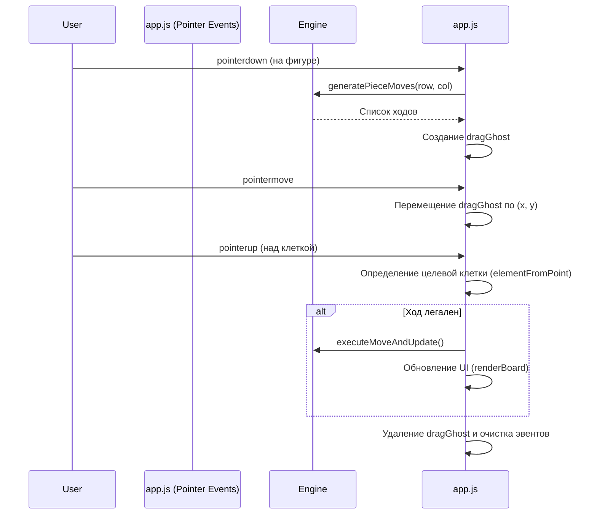

# UI и Экраны

Проект использует Vanilla JS для манипуляции DOM. Экраны реализованы как отдельные `div` контейнеры в `index.html`, переключение между которыми происходит за счет добавления/удаления CSS-класса `active`.

## Менеджмент экранов (`showScreen`)

Логика навигации инкапсулирована в функции `showScreen(name)`.

```javascript
function showScreen(name) {
    // Скрываем все экраны
    Object.values(screens).forEach(s => s.classList.remove('active'));
    
    // Показываем нужный экран
    if (screens[name]) screens[name].classList.add('active');
    currentScreen = name;
    
    // Добавляем специфичные классы на body для стилизации
    document.body.classList.toggle('setup-screen-active', name === 'setup');
}
```

Приложение содержит несколько основных экранов: `menu` (главное меню), `setup` (настройка доски/режима), `game` (основной игровой процесс) и `shop` (магазин между уровнями).

## Модальные окна

Модальные окна (например, окно выбора предмета или подтверждения) реализованы через наложение поверх основного контента. Они имеют свои функции открытия/закрытия, которые переключают `display: flex/none` или классы видимости. В модальных окнах часто используется динамическое создание DOM-элементов для отображения карточек предметов из `ITEMS_DB`.

## Логика Drag & Drop

В проекте используется универсальная система Drag & Drop на основе **Pointer Events API**. Эта реализация заменила использовавшийся ранее полифил (`mobile-drag-drop`) для унифицированной, нативной и плавной работы как с мышью, так и с сенсорными экранами без сторонних библиотек.

### Основной флоу DnD:

1. **`pointerdown` (Начало)**: Определяется перетаскиваемый элемент (фигура или предмет). Создается клон элемента (`dragGhost`), который абсолютно позиционируется по координатам курсора. Назначаются глобальные обработчики `pointermove` и `pointerup`.
2. **`pointermove` (Движение)**: `dragGhost` перемещается вслед за указателем. Оригинальный элемент визуально скрывается (или делается полупрозрачным). Если фигура проносится над доской, подсвечиваются возможные ходы и клетка-цель.
3. **`pointerup` (Завершение)**: Вычисляется целевая клетка на основе `document.elementFromPoint()`. Если ход валиден, вызывается логика хода (или применение предмета). Затем `dragGhost` удаляется, глобальные обработчики снимаются, и восстанавливается видимость оригинального элемента.


