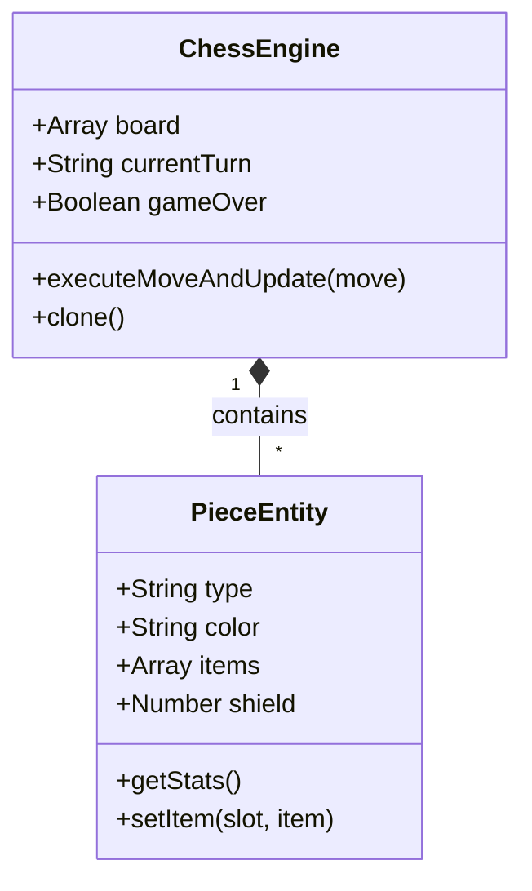

# Управление состоянием (State Management)

Управление состоянием игры централизовано в классе `ChessEngine` и вспомогательном классе `PieceEntity`.

## Состояние доски (`ChessEngine`)

Доска хранится как двумерный массив 8x8 (`this.board`), где каждая клетка содержит либо ссылку на экземпляр `PieceEntity`, либо `null`.

```javascript
class ChessEngine {
    constructor() {
        this.reset();
    }
    reset() {
        this.board = this.createEmptyBoard(); // Array(8).fill(Array(8))
        this.currentTurn = 'white';
        this.moveHistory = [];
        this.castlingRights = { ... };
        this.gameOver = false;
        // ...
    }
}
```

Все изменения на доске (перемещение фигур, взятие, превращение) мутируют этот массив. Для симуляции ходов ИИ используется глубокое копирование состояния (`this.clone()`), которое создает новый экземпляр `ChessEngine` с копиями всех `PieceEntity`.

## Структура объекта фигуры (`PieceEntity`)

Каждая фигура на доске является экземпляром класса `PieceEntity`. В отличие от классических шахмат, фигуры здесь могут иметь инвентарь (до 3 слотов) и модифицируемые характеристики (щиты, заморозка, эффекты от предметов).

```javascript
class PieceEntity {
    constructor(type, color, id) {
        this.id = id || PieceEntity._nextId++;
        this.type = type;       // 'king', 'queen', 'rook' и т.д.
        this.color = color;     // 'white' | 'black'
        this.items = [null, null, null]; // Инвентарь: 3 слота для предметов
        this.shield = 0;        // Текущий уровень щита
        this.moveCount = 0;
        this.alive = true;
    }

    // Динамический расчет статов на основе надетых предметов
    getStats() {
        const stats = { extraRange: 0, shield: 0, dodgeChance: 0, /* ... */ };
        // Логика прохода по this.items и суммирования модификаторов
        return stats;
    }
}
```



## Хранение предметов

База данных предметов статична и хранится в `ITEMS_DB` (`items-db.js`). Когда предмет выдается фигуре, его копия или ссылка помещается в массив `items` соответствующего `PieceEntity`. Метод `getStats()` автоматически пересчитывает бонусы при каждом обращении (например, при генерации возможных ходов).
